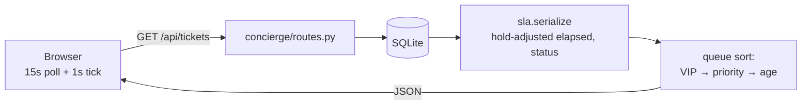

# Concierge — IT Service Desk Console

[](https://github.com/AliA154/concierge/actions/workflows/ci.yml)

**Live demo: https://concierge-y6ju.onrender.com**
*(free tier — the first load after idle can take up to a minute to wake up)*

A single-screen service desk console built around one idea: VIP incidents never
sit in a queue. Tickets flagged VIP jump to the front and run on half the normal
SLA clock, with per-second countdowns, hold-aware SLA accounting, and a full
audit trail on every ticket.


## What it does

- **Derived priority** — priority is computed from Impact × Urgency (the ITIL
  matrix), never picked directly. High impact + high urgency = Critical.
- **VIP routing + tighter clocks** — VIP tickets sort first and get half the
  SLA target. VIP is a clock modifier, not a priority bump.
- **Hold-aware SLA clocks** — the clock pauses while a ticket is On Hold, and
  accrued hold time is subtracted from elapsed everywhere.
- **Audit trail** — every create, state change, assignment, reopen, and work
  note is an event with an actor and timestamp, rendered as a timeline.
- **Resolved vs Closed + reopens** — resolution and closure are distinct steps,
  and reopened tickets carry a visible reopen count.
- **Agents** — tickets have owners; taking an unassigned ticket auto-assigns it
  to the acting agent.

## Design decisions

- **SLA is computed at read time, never stored.** There are no background jobs
  and no stored status to drift; every response derives status from timestamps.
- **The clock stops On Hold.** Entering hold stamps `on_hold_since`; leaving it
  adds the stretch to `held_minutes`. Effective elapsed = wall clock − completed
  holds − the in-progress hold. Waiting on a requester should not burn the SLA.
- **Priority is derived, not picked.** Client-sent priority is ignored; changing
  priority means changing impact or urgency.
- **SLA outcome freezes at first resolution.** Reopening cannot retroactively
  un-breach an SLA (or breach a met one). The live clock resumes, but the
  ticket's metrics contribution stays the first verdict.
- **Attainment is measured over completed work.** `sla_met_pct` counts frozen
  outcomes only; live pain shows separately in the Breaching tile, so an open
  breach never muddies the historical rate.
- **Held VIP tickets stay on top.** On Hold tickets keep their queue position
  with a paused chip rather than sinking — out of sight is how held VIP tickets
  get forgotten.
- **SQLite on an ephemeral disk.** Render's free tier wipes the DB on deploy,
  so `init_db()` just creates the final schema and the seed repaints the demo —
  a migration runner would have nothing to migrate. Production would swap in
  Postgres and a real migration tool; nothing else changes.
- **Polling over WebSockets.** A 15s poll plus client-side 1s ticking is ample
  at this scale and removes a whole class of connection-state bugs.
- **No pagination.** The demo dataset is bounded by design; this is a stated
  non-decision, not an oversight.

## API

| Endpoint | Method | Body | Returns | Errors |
|---|---|---|---|---|
| `/api/meta` | GET | — | enums, priority matrix, SLA targets, transitions, agents | — |
| `/api/tickets` | GET | — | `{now, queue, resolved, metrics}` | — |
| `/api/tickets` | POST | `{subject, requester, ticket_type?, impact?, urgency?, is_vip?}` | 201 + Ticket, `Location` header | 400 validation |
| `/api/tickets/<id>` | GET | — | `{now, ticket, events}` | 404 |
| `/api/tickets/<id>` | PATCH | `{state?, assigned_to?}` | Ticket | 400 illegal transition / unknown agent, 404 |
| `/api/tickets/<id>/notes` | POST | `{note}` | 201 + Event | 400 (empty, >1000 chars, Closed), 404 |
| `/api/tickets/<id>/reopen` | POST | — | Ticket | 400 unless Resolved, 404 |
| `/api/demo/reset` | POST | — | `{ok, message}` | 429 within 10s of last reset |

Every error uses the same JSON envelope: `{"error": {"code": 400, "message": "..."}}`.
Mutating requests may carry an `X-Agent` header naming the acting agent (cosmetic,
unauthenticated by design).

## Architecture



```
app.py                  thin shim: gunicorn app:app
concierge/__init__.py   app factory (create_app)
concierge/sla.py        pure domain logic: matrix, SLA math, serialize, metrics
concierge/db.py         SQLite connection + schema
concierge/routes.py     all endpoints (one blueprint)
concierge/seed.py       curated deterministic demo data
tests/                  pytest suite over the SLA math, queue, API, and seed
templates/, static/     vanilla HTML/CSS/JS frontend (no build step, no deps)
render.yaml             Render deploy config
```

## Run it

```bash
python3 -m venv .venv && source .venv/bin/activate
pip install -r requirements.txt
python app.py        # http://127.0.0.1:5001 — seeds demo data automatically
```

Run the tests:

```bash
pip install -r requirements-dev.txt
pytest
```
