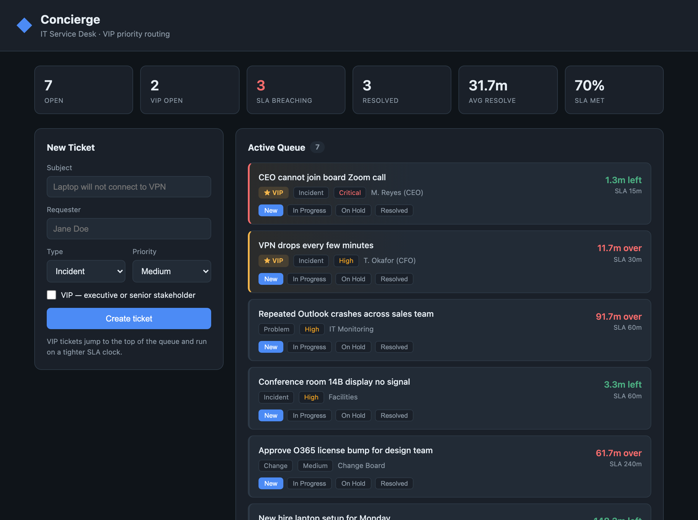

# Concierge — IT Service Desk Console

**Live demo: https://concierge-y6ju.onrender.com**
*(hosted on a free tier, so the first load after it has been idle may take up to a minute to wake up)*

A lightweight IT support desk built to model how a real service desk prioritizes
work. The core idea is simple: high-priority incidents from executives and senior
stakeholders should never sit and wait in a queue. Concierge flags those tickets,
pushes them to the top, and runs them on a tighter SLA clock.

Built to understand the prioritization logic behind tools like ServiceNow.



## What it does

- **ITIL ticket types** — every ticket is an Incident, Request, Problem, or Change,
  and moves through New → In Progress → On Hold → Resolved.
- **VIP priority routing** — tickets flagged VIP (executives, senior stakeholders,
  their assistants) jump to the front of the queue and get half the normal SLA time.
- **Live SLA timers** — each ticket shows time remaining against its target, and
  turns red when it breaches. Targets scale by priority (Critical 30m ... Low 480m).
- **Metrics row** — open count, VIP open, tickets currently breaching SLA, average
  resolve time (MTTR), and overall SLA-met percentage.

## Queue logic

Open tickets are sorted by, in order:

1. VIP status (VIP first)
2. Priority severity (Critical → High → Medium → Low)
3. Age (oldest first)

So a VIP Critical incident always sits above a routine request, which is exactly
how a desk supporting executives has to run.

## Stack

- **Backend:** Python + Flask, SQLite for storage
- **Frontend:** vanilla HTML/CSS/JS single-page dashboard
- No external services, runs entirely on your machine.

## Run it

```bash
python3 -m venv .venv
source .venv/bin/activate
pip install -r requirements.txt

python seed.py      # optional: loads sample tickets
python app.py       # serves at http://127.0.0.1:5001
```

Open http://127.0.0.1:5001 in a browser.

## Project layout

```
app.py              Flask API + SLA / priority logic
seed.py             sample data for the demo
templates/index.html  dashboard markup
static/style.css      dashboard styling
static/app.js         front-end logic and polling
```

## Possible next steps

- Active Directory style user admin (onboarding / offboarding)
- Scheduled morning health checks for conference-room AV and printers
- Knowledge-base assistant for common issues
